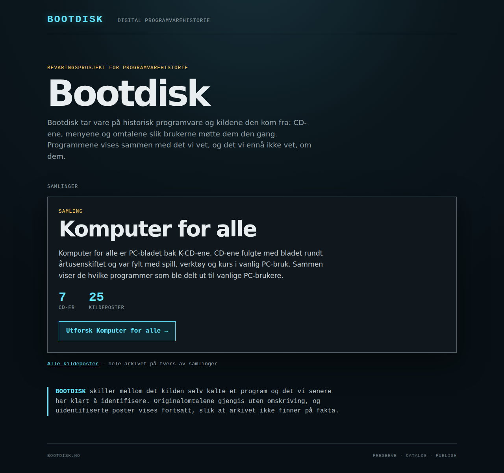

# Bootdisk-forsiden og Komputer for alle-samlingen

Rotadressen er nå en forside med Bootdisk som avsender. Komputer for alle er første
samling, med egen side for introduksjon og CD-oversikt. Hver CD åpner arkivet filtrert
til sitt innhold, og detaljsidene viser veien tilbake: Bootdisk → Komputer for alle →
K-CD 13/2000 → kildepost.



Skjermbildene i `docs/publication/` er tatt av en pakket release med **syntetiske
data**: tellingene (7 CD-er, 25 kildeposter) og «Prøvepost»-titlene er oppdiktet og sier
ingenting om det ekte arkivet.

## Kjør forhåndsvisningen

Syntetisk pakke, bygget med den vanlige releasebyggeren fra oppdiktede data:

```sh
python tests/synthetic_collection.py /tmp/bootdisk-landing-synthetic
python -m http.server --bind 127.0.0.1 --directory /tmp/bootdisk-landing-synthetic 8796
```

Åpne <http://127.0.0.1:8796/>. Port 8772 og 8794 brukes ikke.

## Filer

| Fil | Rolle |
|---|---|
| `collections.json` | Web-eid samlingsregister: nøkkel, navn, tekst, kilder og kobling til `publication`. Format og validering i [datakontrakten](frontend-data-contract.md#collection-registry--public-front-page). |
| `collection-core.js` | DOM-fri logikk: validering av register og indeks, telling per medie-ID, numerisk sortering, gruppering etter år. |
| `landing.js` | Forsiden i `index.html` når `entry` mangler. |
| `collection.html`, `collection.js` | Samlingssiden. |
| `publication.css` | Stil for forside, samlingsside og brødsmuler. |
| `app.js`, `archive.js` | Detaljsiden fikk brødsmuler og ærlige feilvisninger; arkivet viser valgt CD med vei tilbake til samlingen. |
| `scripts/collection_registry.py` | Byggeporten for registeret. Kjøres av `build-release.py`. |
| `scripts/check-collection-page.py` | Nettleserkontroll av en servert release mot forventede CD-er og tellinger. |
| `tests/synthetic_collection.py` | Syntetiske data og forhåndsvisningspakke. |

Ny samling eller ny CD er data og konfigurasjon. En åttende CD dukker opp når data bygges
på nytt. En ny publikasjon får en ny oppføring i `collections.json` med sine
`publication_values`. Sidene endres ikke.

## Tilstander

| Tilstand | Forside | Samlingsside |
|---|---|---|
| Laster | «Laster samlingene…» | «Laster samlingen…», deretter «Laster CD-oversikten…» mens teksten allerede vises |
| Tom | «Ingen samlinger er publisert ennå» | «Samlingen har ingen publiserte CD-er ennå» |
| Ukjent eller usikker nøkkel | – | «Fant ikke samlingen», `noindex`, ingen canonical |
| Datafeil (HTTP-feil, ugyldig JSON, ugyldig register eller indeks) | Feilmelding: «Det betyr ikke at arkivet er tomt» | Feilmelding: «Det betyr ikke at samlingen er tom» |
| Uten JavaScript | Statisk Bootdisk-tekst, lenke til alle kildeposter og forklaring | Forklaring og lenker |

Ingen tilstand viser prøvedata eller null CD-er ved feil.

## Kontrollmatrise

Kjørt på `feat/publication-landing`. Automatiserte tester ligger i
`tests/test_publication.py` (bygg, register, Node-logikk) og
`tests/test_publication_browser.py` (Chromium via Playwright). Nettlesertestene hoppes
over uten Playwright, som i CI.

| Kjøring | Funnet | Bestått | Feilet | Hoppet over |
|---|---:|---:|---:|---:|
| Før endringen (main `e8212e1`), Chromium 141 og Catalog-checkout | 126 | 126 | 0 | 0 |
| Denne grenen, Chromium 141 (Playwright 1.63) og Catalog `7d22183` | 165 | 165 | 0 | 0 |
| Denne grenen uten Playwright og Catalog, som i CI | 165 | 118 | 0 | 47 |

Av de 39 nye testene er 22 uten nettleser og 17 i Chromium. En hoppet nettlesertest er
ikke bestått. Motor og testet commit står i PR-beskrivelsen.

| # | Scenario | Forventet | Faktisk | Bevis |
|---|---|---|---|---|
| 1 | `/` og `/index.html` uten `entry` | Forside, ingen omdirigering, canonical `https://bootdisk.no/` | Som forventet | `test_root_and_index_show_the_front_page_without_redirect` (feiler med gammel `app.js`: havner på `archive.html`); HTTP-verifikatoren sjekker begge adressene |
| 2 | Forside → samling → CD → detalj → tilbake | Riktige navn, CD-filter og søk bevares | Som forventet | `test_front_page_collection_cd_entry_and_back` |
| 3 | Direkte gjenåpning av samlings- og CD-URL | Samme innhold | Som forventet | `test_direct_reopening_gives_the_same_content` |
| 4a | Sju CD-er, hver én gang, numerisk sortert | 15/2001, 8/2001, 1/2001, 13/2000, 9/2000, 4/2000, 1/2000 | Som forventet **på syntetiske data** | `test_every_disc_once_in_numeric_order_with_counts_from_data`, `test_issue_numbers_sort_numerically_and_are_not_months` (feiler med tekstsortering) |
| 4b | De ekte sju CD-ene med 178 kildeposter | 39, 32, 34, 16, 20, 16, 21 | Som forventet, **kjørt av Birk** 24. september 2026 på `11e0bba`, manuelt i nettleser. Ikke kjørt i Claudes miljø, og ikke gjentatt etter registerrettelsen | Birks gjennomgang; kommandoer under «Akseptanse med ekte data» |
| 5 | Ekstra syntetisk CD og fiktiv andre publikasjon | Åttende CD vises automatisk; «Testbladet (fiktiv)» får egne kort og tellinger | Som forventet | `test_an_eighth_disc_appears_without_code_changes`, `test_second_fictional_publication_is_configuration_not_code`, `test_eighth_disc_and_second_publication_come_from_data_and_registry` |
| 6 | Gamle `K37` og nye `kcd-1-2001--K37` | Hver sin post; alle detaljlenker i sitemap og HTTP-kontroll | Som forventet på syntetiske data | `test_old_and_namespaced_k37_open_their_own_entries`, `test_sitemap_lists_front_page_collection_and_every_detail_link_exactly`, `test_http_verifier_passes_and_catches_a_missing_detail_link_or_a_public_curator` |
| 7 | Tellinger med like programnavn, pending-poster og manglende bilder | Kildeposter per medie-ID | Som forventet | `test_collection_view_counts_sorts_and_groups_from_the_index_alone` (Winamp på to CD-er, alle pending, én post uten bilder) |
| 8 | Tom samling, manglende data, ugyldig JSON, ukjent og usikker ID, medier uten samling i registeret | Egen tilstand, ingen prøvedata, ingen nulltelling; et medium uten samling gir feil, ikke lavere telling | Som forventet | `test_states_are_honest` (14 tilfeller), `test_media_without_a_collection_are_an_error_not_left_out`, `test_unknown_and_unsafe_entries_are_not_the_front_page`, `test_registry_and_index_problems_are_reported_not_zeroed`, `test_unregistered_publication_stops_the_build_with_a_clear_message` |
| 9 | Ingen detaljkall ved åpning; HTML-tegn som tekst; ingen skrivekall | Bare `collections.json` og `data/index.json`; bare GET | Som forventet | `test_front_and_collection_pages_read_only_the_index_and_registry`, `test_source_values_with_html_are_text`, `test_new_pages_render_source_values_as_text` |
| 10 | Tastatur, smal skjerm, leserekkefølge, tilbake/ny fane, redusert bevegelse | Synlig fokus, ingen horisontal rulling ved 360 px, logisk overskriftsrekkefølge | Som forventet. Ny fane: kortene er vanlige lenker uten klikkskript; midtklikk er ikke prøvd særskilt | `test_keyboard_reaches_every_card_with_visible_focus`, `test_narrow_screen_has_no_horizontal_scroll`, `test_disc_labels_fit_inside_their_cards`, `test_heading_order_and_reading_order`, `test_reduced_motion_stops_card_movement`, `test_without_javascript_the_pages_explain_themselves` |
| 11 | Pakket offentlig release over HTTP | Alle nye sider og avhengigheter følger med; kuratering og prøvedata er utelatt | Som forventet for syntetisk pakke. Ekte pakke bygget og HTTP-verifikatoren bestått av Birk på `11e0bba` (178 poster, 576 bildefiler) | `test_release_contains_the_public_pages_and_nothing_private`; verifikatoren krever 404 for kuratorfilene; `check-collection-page.py` mot pakken |
| 12 | Eksisterende tester og innholdsdekning | Består uten svekkede kontroller | Alle 126 gamle tester består. Endringer i gamle tester er listet under | Hele pakken |

### Endringer i eksisterende tester

- Sju eksisterende releasetester bygger med publikasjonen «Test». De sender nå
  `--collections tests/fixtures/collections-test-publication.json`, fordi bygget med vilje
  avviser et medium uten samling.
- Forventet sitemap i `test_release_builder_copies_only_referenced_assets` har fått
  forsiden og samlingssiden. Detaljlenkene er uendret.
- `test_browser_selects_entry_document_from_query_parameter` krevde omdirigeringen til
  arkivet. Den krever nå at den er borte, slik arbeidsordren sier.
- `tests/test_overview_browser.py` lukket aldri Playwright. Det gikk bra så lenge den var
  siste nettleserklasse; med en ny klasse etter den hang hele kjøringen. Den har fått
  `tearDownClass`. Ingen kontroller er fjernet.

### Rettet etter Birks gjennomgang

Nettleseren filtrerte bort medier hvis `publication` ikke sto i registeret. Et utdatert
register ved siden av en nyere indeks ga da en tilsynelatende vellykket side med for lav
telling, eller et tomt arkiv. Nå sjekker `collection-core.js` at hvert medium hører til
en samling før forsiden og CD-oversikten beregnes, og viser den vanlige feilmeldingen
hvis ikke. Byggekontrollen i `scripts/collection_registry.py` er beholdt. De nye
tilfellene i `test_states_are_honest` og
`test_media_without_a_collection_are_an_error_not_left_out` feiler med den gamle
`collection-core.js`. Tilfellene for tom forside og tom samling bruker nå en tom indeks
og en registrert samling uten medier, i stedet for ukoblede medier.

### Rettet underveis

Arkivets filterlinje ga horisontal rulling allerede på main: 1391 px ved 1280 px bredde og
391 px ved 360 px, målt med de syntetiske dataene. Linjen brytes nå, og nedtrekkslistene krymper. Testene
for bredde feiler med gammel `archive-controls.css`.

## Akseptanse med ekte data

Birk kjørte denne på `11e0bba` 24. september 2026: pakken ble bygget, HTTP-verifikatoren
besto, forsiden viste 7 CD-er og 178 kildeposter, og samlingen viste CD-ene i riktig
rekkefølge med 39, 32, 34, 16, 20, 16 og 21 poster. `check-collection-page.py` er ikke
oppgitt som kjørt. Etter registerrettelsen er den ekte akseptansen ikke gjentatt.

Kjøres i en egen worktree, med de lokale dataene som lesekilder og egen outputmappe:

```sh
git -C /Users/stian/Bootdisk/bootdisk-web fetch origin feat/publication-landing
git -C /Users/stian/Bootdisk/bootdisk-web worktree add /Users/stian/Bootdisk/bootdisk-web-landing origin/feat/publication-landing
cd /Users/stian/Bootdisk/bootdisk-web-landing
DATA=/Users/stian/Bootdisk/local-results/five-disc-trial
python scripts/build-release.py "$DATA/collection-data-final" "$DATA/published" \
  --output /tmp/bootdisk-landing-real --expected-entries 178
python -m http.server --bind 127.0.0.1 --directory /tmp/bootdisk-landing-real 8797
```

I en annen terminal:

```sh
python scripts/verify-deployment.py http://127.0.0.1:8797/ --expected-entries 178
python scripts/check-collection-page.py http://127.0.0.1:8797/ \
  --expect "K-CD 15/2001=39" --expect "K-CD 8/2001=32" --expect "K-CD 1/2001=34" \
  --expect "K-CD 13/2000=16" --expect "K-CD 9/2000=20" --expect "K-CD 4/2000=16" \
  --expect "K-CD 1/2000=21"
```

`check-collection-page.py` trenger Playwright og Chromium. Det leser det sidene faktisk
viser: forsidens totaler, kortene i rekkefølge, og at hver CD-lenke åpner riktig antall
kort. Hvis bygget stopper med «which no collection lists in publication_values», har de
ekte mediene en annen `publication`-verdi enn `KOMPUTER FOR ALLE`. Legg den til i
`collections.json`.

## Catalog og andre avhengigheter

Ingen. De nye sidene hører til den offentlige releasen. Catalogs lokale tjeneste
serverer bare kuratorfilene i sin `STATIC`-liste, og av disse er ingen endret
(`styles.css` og `accessibility.css` er uendret). Den lokale kurateringen er ikke berørt og
er ikke testet mot tjenesten i denne leveransen. Ingest, Catalog og Publish er ikke endret.

## Kjente avvik og åpne punkter

- Den ekte akseptansen (4b og 11) er kjørt av Birk på `11e0bba`, ikke i Claudes miljø, og
  ikke gjentatt etter registerrettelsen.
- Utgiverens side er ikke lest; se [kildene](publication-content-sources.md).
- Samlingsteksten kommer fra registeret og krever JavaScript. Uten JavaScript får
  brukeren en forklaring, og forsidens Bootdisk-tekst er statisk. Forhåndsrendring i
  bygget er mulig senere.
- CD-visningen (`archive.html?medium=…`) har arkivets canonical og står ikke i sitemap.
- CD-velgeren i arkivet følger datarekkefølgen, ikke nyeste først.
- Forrige/neste på detaljsiden går fortsatt gjennom hele indeksen, også over CD-grenser.
- Nettstedet har ingen `favicon.ico`, så nettleseren får én 404 på forsiden. Dette gjaldt
  også før.
